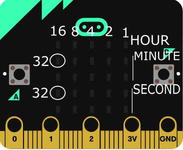
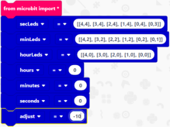
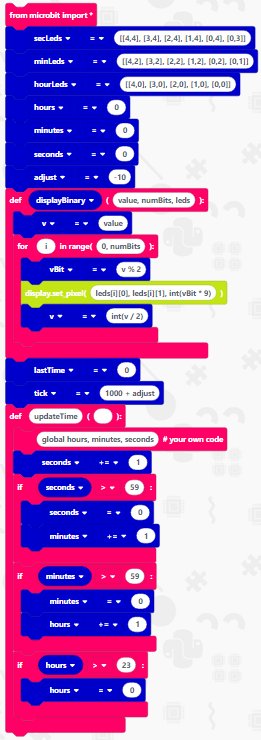
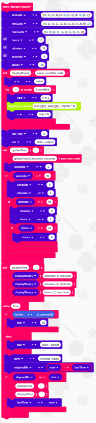
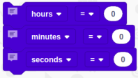
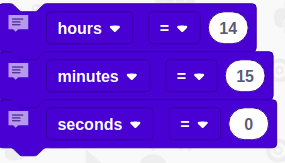

# Binary Clock

Within this tutorial, you are going to create a binary clock using a micro:bit. Binary is a numbering system computers use.

you will keep track of the time by displaying the hours, minutes and seconds as separate binary numbers on the micro:bit LED display.

## Reading the clock

To read the clock you start on the top row of LEDs, this row represents the hours.

Each column of LEDs represents a number. From right to left the columns are numbered 1, 2, 4, 8 and 16. By adding these 5 numbers you can get every value of a 24-hour clock.

The middle two rows represent the minutes and the bottom two rows represent the seconds. Since for the minutes and seconds you need to be able to count up to 60, the left LED on the upper rows represents 32. (See the graphical representation below)

## You Will Need

* 1 x micro:bit

* 1 x micro USB cable

* [EduBlocks Code Editor](http://app.edublocks.org/) (http://app.edublocks.org/)

## Code

### Creating Variables

There are a few variables that you will need, so let's get these out of the way first.

To create a variable click on **Variables** then click on **Create variable...**. This will bring up a text box for you to enter the name of the variable.  Do this for each of the following variables:

[ ] secLeds

[ ] minLeds

[ ] hourLeds

[ ] hours

[ ] minutes

[ ] seconds

[ ] adjust

[ ] vBit

[ ] lastTime

[ ] tick

[ ] displayBinary

[ ] now

[ ] elapsedMs

[ ] v

### Importing micro:bit library and setting up variables

1. Click on **Basic**  
   
2. Click and drag a **from microbit import *** and drop it in the coding area.
   
3. Click on **Variables** Click and drag **adjust = 0** block to the coding area and attach it under **from microbit import ***.
   
4. Click on the small arrow next to **adjust** and click on  **secLeds**
   
5. Click on the **0** and type **[[4,4], [3,4], [2,4], [1,4], [0,4],[0,3]]**
   
6. Click on **Variables**. Click and drag **adjust = 0** block to the coding area and attach it under **secLeds = [[4,4], [3,4], [2,4], [1,4], [0,4], [0,3]]**
   
7. Click on the small arrow next to **adjust** and click on **minLeds**
   
8. Click on the **0** and type **[[4,2], [3,2], [2,2], [1,2], [0,2], [0,1]]**
   
9.  Click on **Variables**. Click and drag **adjust = 0** block to the coding area and attach it under **minLeds = [[4,2], [3,2], [2,2], [1,2], [0,2], [0,1]]**
    
10. Click on the small arrow next to **adjust** and click on **hourLeds**
    
11. Click on the **0** and type **[[4,0], [3,0], [2,0], [1,0], [0,0]]**
    
12. Click on **Variables**. Click and drag **adjust = 0** block to the coding area and attach it under **hourLeds = [[4,0], [3,0], [2,0], [1,0], [0,0]]**
    
13. Click on the small arrow next to **adjust** and click on **hours**
    
14. Click on **Variables**. Click and drag **adjust = 0** block to the coding area and attach it under **hours = 0**
    
15. Click on the small arrow next to **adjust** and click on **minutes**
    
16. Click on **Variables**. Click and drag **adjust = 0** block to the coding area and attach it under **minutes = 0**
    
17. Click on the small arrow next to **adjust** and click on **seconds**
    
18. Click on **Variables**. Click and drag **adjust = 0** block to the coding area and attach it under **seconds = 0**
    
19. Click on the **0** and type **-10**

Your code should now look like this:

### Displaying The Binary

Now to create a function to display the binary number on the micro:bit display.

1. Click on **Basic**. Click and drag a **def  ():** block to the coding area and attach it under the **adjust = -10**
   
2. Click on **Variables**. Click and drag a **displayBinary** block to the coding area and attach it within the first blank spot of the **def** block.
   
3. within the second blank space type **value, numBits, leds**

4. Click on **Variables**, click and drag an **adjust = 0** block to the coding area and attach it within the **def displayBinary (value, numBits, leds):** 

5. Click on the arrow next to **adjust** and click on **v**, click on **0** and type **value**

6. Click on **Basic**, click and drag a **for i in range (number):** block to the coding area and attach it under **v = value** block.

7. Within the **for** block click on **number** and type **0, numBits**

8. Click on **Variables**, click and drag an **adjust = 0** block to the coding area and attach it within the **for i in range (0, numBits):** block

9. Click on the arrow next to **adjust** and click on **vBit**

10. Click on the **0** and type **v % 2**

11. Click on **Display**, click and drag a **display.set_pixel(0,0,5)** block to the coding area and attach it under **vBit = v % 2**

12. Click on **0,05** and type **leds[i][0], leds[i][1], int(vBit * 9)**

13. Click on **Variables**, click and drag an **adjust = 0** to the coding area and attach it under **display.set_pixel(leds[1][0], leds[i][1], int(vBit * 9))**

14. Click on the arrow next to **adjust** and click on **v**, click the **0** and type **int(v / 2)**

15. Click on **Variables**, click and drag an **adjust = 0** block to the coding area and attach it under the **def displayBinary (value, numBits, leds)**

16. Click on the arrow next to **adjust** and click on **lastTime**

17. Click on **Variables**, click and drag an **adjust = 0** block to the coding area and attach it under the **lastTime = 0**

18. Click on the arrow next to **adjust** and click on **tick**, click on the **0** and type **1000 + adjust**

Your code should now look like this:

 

### Updating The Time

Creating a function to update the time

1. Click on **Basic**, click and drag  **def ():** block to the coding area and attach it under **tick = 1000 = adjust**

2. Click on the first blank space and type **updateTime**

3. Click on **Basic**, click and drag a **#your own code** block to the coding area and attach it within the **def updateTime** block

4. Type **global hours, minutes, seconds** within the **#your own code** block

5. Click on **Variables** click and drag an **adjust = 0** block to the coding area and attach it under **global hours, minutes, seconds #your own code**

6. Click on the small arrow next to **adjust** and click on **seconds**, click on the small arrow next to **=** and click on **+=**, click on 0 and type **1**

7. Click on **Basic**, click and drag an **if True:** block to the coding area and attach it under **seconds += 1**

8. Click on **Basic** and click and drag a **0 == 0** block to the coding area and attach it within the **if True** block where it says **True**

9. Click on **Variables**, click and drag a **seconds** block to the coding area and attach it within the first **0** of the **if** block, click on the small arrow next to the **==** sign and click on **>**, click on **0** and type **59**

10. Click on **Variables** click and drag an **adjust = 0** block to the coding area and attach it within the **if seconds > 59:** block

11. Click on the arrow next to **adjust** and click on **seconds**

12. Click on **Variables** click and drag an **adjust = 0** block to the coding area and attach it under **seconds = 0**

13. Click on the arrow next to **adjust** and click on **minutes**, click on the arrow next to **=** and click on **+=** click on **0** and type **1**

14. Right-click on the **if seconds > 59:** block and click on **Duplicate** this will duplicate the if statement. Connect this block under the under if block.

15. Click on the arrow next to **seconds** in the second if statement and click on **minutes**

16. Click on the arrow next to **seconds** within the **if minutes > 59:** block and click on **minutes**

17. Click on the arrow on the block below and click on **hours**

18. Right-click on the **if minutes > 59:** and click **Duplicate** attach it below the other if statement

19. Click on the arrows next to the **minutes** within the last if block and change them to **hours** 

20. Click on **59** within the **if hours > 59** block and type **23**

21. Click and drag the **hours += 1** to the bin down to the right.

Your code should now look like this:

### Displaying The Time

Creating a function that will display the time on the micro:bit

1. Click on **Basic**, click and drag a **def ():** to the coding area and attach it under **def updateTime ():**

2. Within the first gap of the **def ():** block type **displayTime**

3. Click on **Basic**, click and drag a **function_name ()** block to the coding area and attach it within **def displayTime ()**

4. Click on **Variables**, click and drag a **displayBinary** block to the coding area and attach it where the block says **function_name**

5. Within the blank space between the brackets type **seconds, 6, secLeds**

6. Right click on **displayBinary (seconds, 6, secLeds)** and click **Duplicate**, attach it below the **displayBinary (seconds, 6, SecLeds)** block

7. Update the block to read **displayBinary (minutes, 6, minLeds)**

8. Right click on the **displayBinary (minutes, 6, minLeds)** and click **Duplicate** attach the block below **displayBinary (minutes, 6, minLeds)** 

9. Update the block to read **displayBinary (hours, 5, hourLeds)**

Your code should now look like this:

 

### Main Loop

This will bring all of your code together and make your binary clock work!

1. Click on **Basic**, click and drag a **while True:** block to the coding area and attach it under **def displayTime ():**

2. Click on **Basic**, click and drag an **if True:** block to the coding area and attach it within the **while True:** block

3. Click on **Buttons**, click and drag a **button_a.is_pressed** block to the coding area and attach it within the **True** of the **if** block

4. Click on **Variables**, click and drag an **adjust = 0** block to the coding area and attach it within the **if button_a.is_pressed** block. Click on the arrow next to **adjust** and click on tick. Click on the 0 and type **10**

5. Click on  **Basic**, click and drag an **else:** block to the coding area and attach it under the **if button_a.is_pressed():** block

6. Click on **Variables**, click and drag an **adjust = 0** block to the code area and attach it within the **else:** block. Click on the arrow next to **adjust** and click on **tick**. Click on the 0 and type **1000 + adjust**

7. Click on **Variables**, click and drag an **adjust = 0** block to the code area and attach it under the **else:** block. Click on the arrow next to **adjust** and click on **now**. Click on **0** and type **running_time()**

8. Click on **Variables**, click and drag an **adjust = 0** block to the code area and attach it under **now = running_time()**. Click on the arrow next to **adjust** and click on **elapsedMs**

9. Click on **Basic**, click and drag a **2 + 3** block to the code area and attach it within the **0** of **elapsedMs = 0**

10. Click on **Variables**, Click and drag a *now block to the code area and attach it within the first **2** of the **elapsedMs = 2 + 3** block. Click on the arrow next to **+** and click on **-**

11. Click on **Variables**, click and drag a **listTime** block to the code area and attach it within the **3** of the **elapsedMs = now - 3** code block

12. Click on **Basic**, click and drag an **if True:** block to the code area and attach it under **elapsedMs = now - lastTime**

13. Click on **Basic** click and drag a **0 == 0** and attach it within **True** of the **if True:** block

14. Click on **Variables**, click and drag an **elapsedMs** block to the code area and attach it within the first **0** of the **if 0 == 0** block. Click on the arrow next to **==** and click on **>=**

15. Click on **Variables**, click and drag a **tick** block to the coding area and attach it within the **0** of **if elapsedMs >= 0**

16. Click on **Basic**, click and drag a **function_name ()** block to the code area and attach it within the **if elapsedMs >= tick:** block. Click where it says **function_name** and type **updateTime**

17. Right click on **updateTime** and click **Duplicate**. Attach the block under **updateTime ()**. Click on **updateTime** and type **displayTime**

18. Click on **Variables**, click and drag an **adjust = 0** block to the code area and attach it under **displayTime ()** block. Click on the arrow next to **adjust** and click on **lastTime**

19. Click on **Variables**, click and drag a **now** to the code area and attach it within the **0** of **lastTime = 0** block

Your code is now complete and should look like this:

## Setting The Time

Now to set the correct time of your micro:bit.

1. Scroll back to the top of your code and locate the blocks that say hour = 0, minutes = 0 and seconds = 0. (as shown below)

2. Type the current time into the appropriate box. e.g. if the time was 2:15 your code would look like this:

