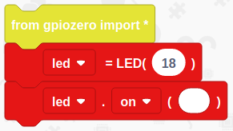
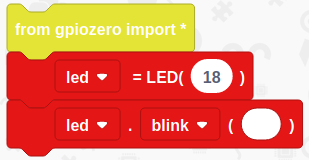

# Controlling an LED

Within this tutorial you are going to learn how to create a simple circuit and using the Raspberry Pi and EduBlocks to control an LED.

## What You Will Need

The equipment you need is:

* 1 x LED
* 2 x Male to Female jumper wires
* 1 x breadboard
* A Raspberry Pi

## Creating The Circuit

Let's create the electronic circuit that we are going to control using Python and a Raspberry Pi.

The Circuit will look like this:

 

**NOTE:** The LED has one short leg known as the cathode (Negative = -) and one long leg known as the anode (positive = +)

The Anode is connected to pin 18 on the Raspberry Pi
The Cathode is connected to ground on the Raspberry Pi

Once the LED is wired to the Raspberry Pi this completes our electronic circuit.

We can now code our LED to do something.

## Coding The LED

### Turning The LED On

1. Open up EduBlocks by clicking on Raspberry Pi Menu > Programming > EduBlocks.

2. Click on **gpiozero**

3. Click on **General**, click and drag a **from gpiozero import *** and drop it within the coding area.

4. Click on **Outputs**
5. Click on **LED**, click and drag an **led = LED ()** block to the coding area and attach it under **from gpiozero import ***
6. Within the gap of **led = LED ()** type **18**. This will set the LED to pin 18 on the Raspberry Pi
7. Click on **LED**, click and drag an **led.on()** block to the coding area and attach it under **led = LED (18)**. This will turn the LED on.

Your code should look like this:

To run the code click on **Run** at the top of the editor.

### Turning an LED Off

To turn the LED off click on the small arrow next to **on** within the **led.on()** block and click on **off**.

Your code should look like this:

Now Click on **Run** to see the LED turn off.

### Making an LED Blink

To make the LED blink on and off click on the small arrow next to **off** within the **led.off()** block and click on **blink**.

Your code should look like this:

Now click on **Run** to see the LED blink on and off.

You now know how to control an LED using a Raspberry Pi and EduBlocks