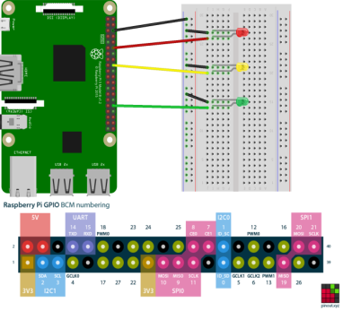
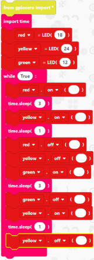

# Traffic Lights

## Overview
Within this tutorial we are going to create a simple circuit using 3 LEDs 1 x red, 1 x yellow and 1 x green. We are going to use EduBlocks and a Raspberry Pi to code and control the LEDs to simulate traffic lights.

## Installing EduBlocks
1. Open a Terminal window by clicking on 
2. If you have used EduBlocks before you will need to delete the old version by typing the following into the Terminal
```bash
edublocks-uninstall
```
3. Now we need to install the new version of EduBlocks by typing the following into the Terminal
```bash
curl -sSL connect.edublocks.org | bash
```

**NOTE:** *If you want EduBlocks to start when your Raspberry Pi starts up type:*
```bash
edublocks-startup-enable
```

## What you will need
* 1 x breadboard
* 1 x Red LED
* 1 x Yellow LED
* 1 x Green LED
* 3 x male to male jumper wires
* 4 x male to female jumper wires
* 1 x Raspberry Pi setup

## Creating the circuit


* Red LED = pin18
* Yellow LED = pin24
* Green LED = pin12

**NOTE:** *Each LED has 1 x long leg, which is the positive leg. This connects to the pins on the Raspberry Pi and 1 x short leg which connects to ground/negative. Within this tutorial the short legs connect to a common ground by connecting to the negative rail on the breadboard then one wire going from there to ground on the Raspberry Pi.*

Once your circuit looks like the diagram above it's time to code.

## Starting EduBlocks

**NOTE:** *If you have EduBlocks starting when the Raspberry Pi starts up, you can skip this section*

1. Click on the Raspberry icon in the top left corner
2. Click on Programming
3. Click on EduBlocks Connect. This will open a Terminal window.
4. Click on the globe icon next to the Raspberry to open a web browser.
5. Type `app.edublocks.org` into the search bar. this will open up the mode selector.
6. Click on Raspberry Pi

#### Lets get coding!

## Code
### Setting up libraries
1. Click on **gpiozero**
2. Click on **General**
3. Click and drag __from gpiozero import *__ to the coding are and drop it there.
4. Click on **Basic**
5. Click and drag an **import time** block and attach it under __from gpiozero import *__

Your code should look like this: <br>


This imports Python Libraries. gpiozero helps us communicate with the GPIO pins on the Raspberry Pi and the time library lets us control pauses within the code.

### Setting up pin numbers
1. Within the **gpiozero** menu click on **Outputs**
2. Click on **LED**
3. Click and drag an **led=LED()** to the code area and attach it under __from gpiozero import *__
4. Click on the arrow next to **led** and click on **Reanme variable** type **red** into the text box and click on OK.
5. Within the blank space between the **()** type **18** (this refers to the pin number that the red LED is connected to on the Raspberry Pi)
6. Click on **LED**
7. Click and drag an **led=LED()** block to the coding area and attach it under the **red=LED(18)** block.
8. Click on the small arrow next to **led** and click on **Rename variable** in the text box type **yellow** and click OK.
9. Within the blank space between **()** type **24** (this corresponds to the pin on the Raspberry Pi that the yellow LED is connected to)
10. Click on **LED**
11. Click and drag an **led=LED()** block to the code area and attach it under the **yellow=LED(24)**
12. Click on the small arrow next to **led** and click on **Rename variable** and type **green** into the text box and click OK.
13. Click within the blank space between **()** and type **12** (this refers to the pin on the Raspberry Pi where the green LED connects to)

<div class="page-break"></div>


Your code should now look like this: <br>


### Setting up a loop
1. Click on Basic
2. Click and drag a **while True:** block to the code area and attach it under the **green=LED(12)** block.

Your code should now look like this: <br>


All code from now on will go inside the **while True:**. This will keep our code running forever simulating traffic lights.

### Turning the red LED on
1. Click on **LED**
2. Click on an **led.on()** block to the coding area and attach it within the **while True:** block
3. Click on the small arrow next to **led** and click on **red**
4. Click on **Basic**
5. Click and drag a **time.sleep(1)** block to the code area and attach it under the **red.on()** block
6. Change the 1 to a 3

Your code should look like this:<br>


This will turn the red LED on for 3 seconds.

### Turning the yellow LED on
1. Click on **LED**
2. Click and drag an **led.on()** block to the code area and attach it under the **time.sleep(3)**
3. Click on the small arrow next to **led** and click on **yellow**
4. Click on **Basic**
5. Click and drag a **time.sleep(1)** block to the coding area and attach it under the **yellow.on()** block

Your code should now look like this:<br>


The red LED is still on and the Yellow LED turns on for 1 second.

### Turning the red and yellow LEDs off and the green LED on
1. Click on **LED**
2. Click and drag an **led.on()** block to the code area and attach it under the **time.sleep(1)** block
3. Click on the small arrow next to **led** and click on **red**
4. Click on the small arrow next to **on** and click on **off**
5. Click on **LED**
6. Click and drag an **led.on()** block to the code area and attach it under the **red.off()** block
7. Click on the small arrow next to **led** and click on **yellow**
8. Click on the small arrow next to **on** and click **off**
9. Click on **LED**
10. Click and drag an **led.on()** block to the code area and attach it under the **yellow.off()** block
11. Click on the small arrow next to **led** and click on **green**
12. Click on **Basic**
13. Click and drag a **time.sleep(1)** block to the code area and attach it under the **green.on()** block.
14. Change the 1 to a 3.

<div class="page-break"></div>

Your code should now look like this:<br>


This turns the Red and Yellow LEDs off and turns the Green LED on for 3 seconds.

### Turning the yellow LED back on
1. Click on **LED**
2. click and drag an **led.on()** block to the code area and attach it under **time.sleep(3)** block
3. Click on the small arrow next to **led** and click on **green**
4. Click on the small arrow next to **on** and click on **off**
5. Click on **LED**
6. Click and drag an **led.on()** block to the code area and attach it under **green.off()**
7. Click on the small arrow next to **led** and click on **yellow**
8. Click on **Basic**
9. Click and drag a **time.sleep(1)** block to the code area and attach it under **yellow.on()**

<div class="page-break"></div>

Your code should now look like this:<br>


This turns the green LED off and the yellow LED back on for 1 second.

## Turning the yellow LED off
1. Click on **LED**
2. Click and drag an **led.on()** block to the code area and attach it under the **time.sleep(1)** block
3. click on the small arrow next to **led** and click on **yellow**
4. Click on the small arrow next to **on** and click on **off**

#### Your code is now complete!

<div class="page-break"></div>

## Completed Code


## Running the Code
1. click on this icon 
2. Click on **Run**

You should now see your LEDs running in the sequence of traffic lights.
