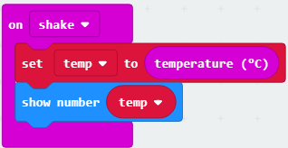

# Temperature Sensing

Within this tutorial, you will use a micro:bit to sense the temperature of the environment around you.

## You Will Need

* 1 x micro:bit
* 1 x micro USB cable
* [MakeCode editor](https://makecode.microbit.org) (https://makecode.microbit.org)

## Setting Up Variables

Think of variables as storage containers.

1. Click on **Variables**
2. Click on **Make a Variable...**
3. Type **temp** and click **ok**

## Main Code

1. Click on **Input**, click and drag an **on shake** block to the coding area and drop it.
2. Click on **Variable**, click and drag **set temp to 0** to the coding area and attach it within **on shake**.
3. Click on **Input**, click and drag a **temperature** block to the coding area and attach it within the **0** of the **set temp to 0** block.
4. Click on **Basic**, click and drag a **show number** block to the code area and attach it under **set temp to temperature**.
5. Click on **Variables**, click on **temp** and drag it to the coding area and attach it within the **0** of **show number**.

Your code should look like this:

## Downloading & Running the Code

Click on the **Download** button to download your code the micro:bit.

You will see a light blink on the back of the micro:bit, once this has finished blinking you can disconnect the micro:bit from the computer and attach the battery pack.

Shake the micro:bit to see the temperature of the environment around you!

Let's take them outside and see what temperature we get then!